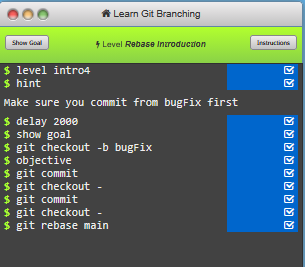

# TP 04 - Les Fusions

## 1. Avance rapide

* Je commence par créer le dossier `merge-lab/`

  ```bash
  mkdir merge-lab/
  cd merge-lab/
  ```
* Puis j’initialise le dépôt dans ce dossier

  ```bash
  git init
  Initialized empty Git repository in D:/Obsidian Vault/COURS-B3/VERSIONING/merge-lab/.git/
  ```
* Premier commit sur `main` avec `fichier.txt` (trois lignes)

  ```bash
  git add fichier.txt
  
  git commit -m "Premier Commit avec fichier.txt"
  [main (root-commit) 3530290] Premier Commit avec fichier.txt
   1 file changed, 3 insertions(+)
   create mode 100644 fichier.txt
  ```
* Je change et crée une nouvelle branche `feature-a`

  ```bash
  git switch -c feature-a
  Switched to a new branch 'feature-a'
  ```
* J'ajoute une ligne et je commit

  ```bash
  git commit -am "Deuxième commit avec ajout de ligne"
  [feature-a f330b54] Deuxième commit avec ajout de ligne
   1 file changed, 1 insertion(+)
  ```
* Je reviens sur `main`

  ```bash
  git checkout main
  Switched to branch 'main'
  ```

### Prédiction : commit de fusion ou pas ?

* Pas de commit de fusion

### Fusion

```bash
git merge feature-a
Updating 3530290..f330b54
Fast-forward
 fichier.txt | 1 +
 1 file changed, 1 insertion(+)
```

```bash
git lg
* f330b54 (HEAD -> main, feature-a) Deuxième commit avec ajout de ligne
* 3530290 Premier Commit avec fichier.txt
```

### Pourquoi pas de commit de fusion

* Car il n’y a eu aucune modification sur la main

## 2. Forcer le commit de fusion

* Je crée `feature-b` depuis `main` et je fais un commit dessus

  ```bash
  git switch -c feature-b
  Switched to a new branch 'feature-b'
  
  git commit -am "Nouvelle ligne 2 feature-b"
  [feature-b 059d97d] Nouvelle ligne 2 feature-b
   1 file changed, 2 insertions(+), 1 deletion(-)
  ```
* Je retourne sur `main` et je fais un commit sur un autre fichier

  ```bash
  git checkout main
  Switched to branch 'main'
  
  git add fichier2.txt
  
  git commit -m "Ajout fichier2"
  [main e920d43] Ajout fichier2
   1 file changed, 1 insertion(+)
   create mode 100644 fichier2.txt
  ```
* Fusion avec `--no-ff`

  ```bash
  git merge --no-ff feature-b
  Merge made by the 'ort' strategy.
   fichier.txt | 3 ++-
   1 file changed, 2 insertions(+), 1 deletion(-)
  ```

### Nombre de parents du commit de fusion

```bash
git cat-file -p HEAD | grep parent
parent e920d437cddb12c8a6ef96a0c10c5cac29e5d256
parent 059d97d2328f0a20b7a999b5bee75015d808c3f9
```

* 

### Graphe (main et feature qui se séparent puis se rejoignent)

```bash
git lg
*   e25e629 (HEAD -> main) Merge branch 'feature-b'
|\  
| * 059d97d (feature-b) Nouvelle ligne 2 feature-b
* | e920d43 Ajout fichier2
|/  
* f330b54 (feature-a) Deuxième commit avec ajout de ligne
* 3530290 Premier Commit avec fichier.txt
```

## 3. Le conflit

* Je crée `feature-c` depuis `main`, je modifie la même ligne de `fichier.txt` et je commit

  ```bash
  git switch -c feature-c
  Switched to a new branch 'feature-c'
  
  git commit -am "Modif fichier.txt"
  [feature-c 06069f2] Modif fichier.txt
   1 file changed, 1 insertion(+), 1 deletion(-)
  ```
* Sur `main`, je modifie la même ligne avec un autre contenu et je commit

  ```bash
  git checkout main
  Switched to branch 'main'
  
  git commit -am "Modif fichier.txt main"
  [main 470d807] Modif fichier.txt main
   1 file changed, 1 insertion(+), 1 deletion(-)
  ```
* Fusion

  ```bash
  git merge feature-c
  Auto-merging fichier.txt
  ```

### Message d'erreur exact de Git

```
CONFLICT (content): Merge conflict in fichier.txt
Automatic merge failed; fix conflicts and then commit the result.
```

### Contenu de `fichier.txt` en conflit (avec les marqueurs)

```
Ligne 1
Ligne 2
Ligne 3
NOUVELLE LIGNE
<<<<<<< HEAD
MODIFICATION MAIN
=======
MODIFICATION FEATURE-C
>>>>>>> feature-c
```

### Résolution

* Version gardée :

  ```
  Ligne 1
  Ligne 2
  Ligne 3
  NOUVELLE LIGNE
  MODIFICATION FEATURE-C
  ```
* Commandes

  ```bash
  git add fichier.txt
  git merge --continue
  [main a4f3a95] Merge branch 'feature-c'
  ```
* Commande qui termine la fusion :

  `git merge --continue`
* Si j'oublie le `git add` :

  Erreur, car le fichier résolu n’est pas ajouté, donc c’est encore le fichier avec conflits qui est dans le commit

### Graphe final

```bash
git log --oneline --graph --all
*   a4f3a95 (HEAD -> main) Merge branch 'feature-c'
|\  
| * 06069f2 (feature-c) Modif fichier.txt
* | 470d807 Modif fichier.txt main
|/  
*   e25e629 Merge branch 'feature-b'
|\  
| * 059d97d (feature-b) Nouvelle ligne 2 feature-b
* | e920d43 Ajout fichier2
|/  
* f330b54 (feature-a) Deuxième commit avec ajout de ligne
* 3530290 Premier Commit avec fichier.txt
```

* Commit de fusion : a4f3a95 (HEAD -> main) Merge branch 'feature-c'
* Ses deux parents : 470d807 Modif fichier.txt main | 06069f2 (feature-c) Modif fichier.txt

## 4. Learn Git Branching

* Suite de commandes du niveau 4 :

  